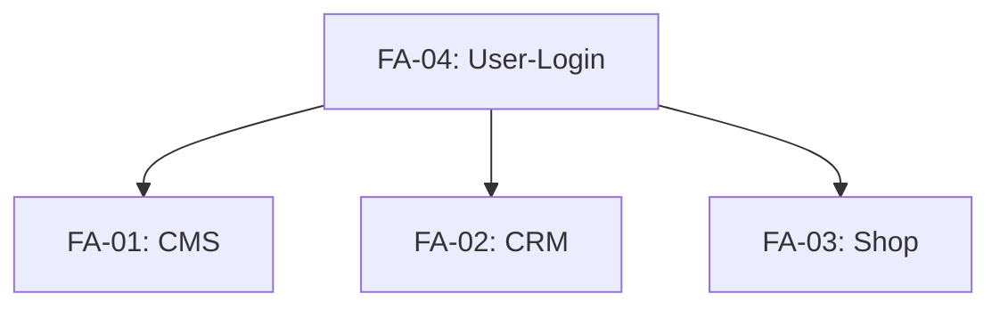

# 2. Funktionale Anforderungen

> **Hinweis:** Die nachfolgenden Anforderungen leiten sich aus der Projektbeschreibung der `README.md` ab und wurden für die konkrete Planung und Umsetzung detailliert, priorisiert und mit Akzeptanzkriterien versehen.

---

## Priorisierung

| Priorität | Bedeutung |
|---|---|
| **P1 – Must-have** | Ohne dieses Feature ist das System nicht lieferbar (MVP). |
| **P2 – Should-have** | Wichtiges Feature, das den Mehrwert deutlich steigert. |
| **P3 – Nice-to-have** | Kann bei Zeitknappheit in eine spätere Version verschoben werden. |

---

## FA-01: Content-Management-System (CMS) – Blog & News

- **Priorität:** P1 – Must-have
- **Quelle:** README.md – *"CMS: Sie wollen ihre News und Blogartikel selbst pflegen können."*

### Beschreibung

Als Administrator (Geschäftsführer/Redakteur) möchte ich Blog-Artikel und News-Beiträge erstellen, bearbeiten und löschen können, ohne dafür technische Kenntnisse (z. B. HTML oder Git) zu benötigen. Die Inhalte sollen automatisch auf der öffentlichen Webseite erscheinen, sobald sie veröffentlicht werden.

### Funktionale Teil-Anforderungen

| ID | Anforderung |
|---|---|
| FA-01.1 | Admin kann Artikel mit **Titel, Inhalt (Rich-Text), Autor, Veröffentlichungsdatum und Status (Entwurf/Veröffentlicht)** anlegen. |
| FA-01.2 | Admin kann bestehende Artikel **bearbeiten und speichern** (auch bereits veröffentlichte). |
| FA-01.3 | Admin kann Artikel **löschen** (mit Bestätigungsdialog). |
| FA-01.4 | Admin kann **Bilder hochladen** und in Artikeln einbetten. |
| FA-01.5 | Die öffentliche Webseite zeigt eine **chronologisch sortierte Liste** (neueste zuerst) aller veröffentlicher Artikel an. |
| FA-01.6 | Die öffentliche Webseite zeigt eine **Detailansicht** für einen einzelnen Artikel an. |

### Akzeptanzkriterien

1. Ein Artikel ist im Admin-Dashboard erstellbar und nach dem Speichern sofort auf der öffentlichen Seite sichtbar (sofern Status = "Veröffentlicht").
2. Bilder können hochgeladen werden und werden im Artikel korrekt angezeigt.
3. Das Löschen eines Artikels entfernt ihn vollständig von der öffentlichen Seite.
4. Die Artikelliste ist immer absteigend nach Datum sortiert (neuester zuerst).

### Technische Hinweise

- Datenhaltung in Firebase Firestore (Collection `articles`) oder Supabase PostgreSQL (Tabelle `articles`).
- Bild-Upload über Firebase Storage / Supabase Storage.
- Rich-Text-Editor z. B. Quill.js, TipTap oder TinyMCE (einfach integrierbar).

---

## FA-02: Customer-Relationship-Management (CRM) – E-Mail-Newsletter

- **Priorität:** P1 – Must-have
- **Quelle:** README.md – *"CRM: Sie wollen Kunden per E-Mail-Newsletter binden."*

### Beschreibung

Als Administrator möchte ich Newsletter an alle Abonnenten versenden können. Als Besucher möchte ich mich mit meiner E-Mail-Adresse für den Newsletter anmelden können.

### Funktionale Teil-Anforderungen

| ID | Anforderung |
|---|---|
| FA-02.1 | Ein **öffentliches Anmeldeformular** (E-Mail-Adresse + optional Name) ist auf der Webseite vorhanden. |
| FA-02.2 | Nach der Anmeldung erhält der Besucher eine **Bestätigungs-E-Mail (Double-Opt-In)**. |
| FA-02.3 | Die Abonnenten-Daten (E-Mail, Name, Anmeldedatum) werden in einer Datenbank gespeichert. |
| FA-02.4 | Admin kann im Dashboard **eine Liste aller Abonnenten** einsehen. |
| FA-02.5 | Admin kann **Abonnenten manuell löschen**. |
| FA-02.6 | Admin kann einen **Newsletter verfassen und an alle aktiven Abonnenten versenden**. |
| FA-02.7 | Ein **Abmeldelink** ist in jeder Newsletter-E-Mail enthalten. |
| FA-02.8 | Die **Anzahl der Abonnenten** wird im Admin-Dashboard als Statistik angezeigt. |

### Akzeptanzkriterien

1. Das Anmeldeformular ist auf der öffentlichen Seite sichtbar und funktionsfähig.
2. Nach der Anmeldung erhält der Besucher eine Bestätigungsmail; der Eintrag wird erst nach Bestätigung aktiv.
3. Der Newsletter-Versand erreicht alle aktiven Abonnenten (keine Fehler bei gültigen E-Mail-Adressen).
4. Der Abmeldelink funktioniert und deaktiviert den Abonnenten sofort.

### Technische Hinweise

- Nutzung von **Brevo** (ehemals Sendinblue) oder **MailChimp** über deren REST-API.
- Double-Opt-In über die jeweilige API des E-Mail-Dienstes realisieren.
- Bei Firebase: Cloud Function als API-Proxy für den E-Mail-Dienst (Schutz des API-Keys).

---

## FA-03: Shop-Funktionalität

- **Priorität:** P2 – Should-have
- **Quelle:** README.md – *"Shop-Funktion: Es soll eine sehr kleine Shop-Funktionalität integriert sein (Produkte ansehen, Warenkorb füllen), jedoch ohne die komplexe Zahlungsabwicklung (nur bis zum 'Kauf'-Button)."*

### Beschreibung

Als Besucher möchte ich Produkte ansehen, in einen Warenkorb legen und zur Kasse gehen können – jedoch **ohne** eine echte Zahlung auszulösen. Der "Kauf"-Button dient als UI-Demonstration.

### Funktionale Teil-Anforderungen

| ID | Anforderung |
|---|---|
| FA-03.1 | Eine **Produktübersichtsseite** zeigt alle verfügbaren Produkte mit Bild, Name, Kurzbeschreibung und Preis an. |
| FA-03.2 | Eine **Produktdetailseite** zeigt alle Produktinformationen (auch Beschreibung, Varianten) an. |
| FA-03.3 | Produkte können **in den Warenkorb gelegt** werden (Menge wählbar). |
| FA-03.4 | Der **Warenkorb** ist jederzeit einsehbar (Anzahl der Artikel, Summe). |
| FA-03.5 | Der Besucher kann die **Menge im Warenkorb ändern** oder **Artikel entfernen**. |
| FA-03.6 | Ein **"Kauf"-Button** im Warenkorb leitet auf eine Checkout-Seite weiter. |
| FA-03.7 | Die Checkout-Seite zeigt eine **Zusammenfassung** und einen **finalen "Kaufen"-Button**, der eine **Bestätigungsseite** öffnet (keine echte Zahlung). |
| FA-03.8 | Admin kann **Produkte im Dashboard anlegen, bearbeiten und löschen** (analog zu Artikeln). |

### Akzeptanzkriterien

1. Produkte sind auf der öffentlichen Seite sichtbar und enthalten alle relevanten Informationen.
2. Der Warenkorb funktioniert clientseitig (LocalStorage) – Artikel bleiben beim Seitenwechsel erhalten.
3. Der "Kauf"-Button zeigt eine Bestätigung an, löst aber keine Zahlung aus.
4. Der Warenkorb-Button zeigt die Anzahl der Artikel (Badge) an.

### Technische Hinweise

- **Keine echte Zahlungsabwicklung** – Stripe/PayPal nur für UI-Komponenten (Preisanzeige), nicht für Transaktionen.
- Produktdaten in Firestore/Supabase (Collection `products`).
- Warenkorb-Zustand in `localStorage` (clientseitig) – optional später in User-Profil speicherbar.
- Preisformatierung clientseitig (z. B. `Intl.NumberFormat` für Euro).

---

## FA-04: Benutzerregistrierung & Login

- **Priorität:** P1 – Must-have
- **Quelle:** README.md – *"User-Login: Nutzer sollen sich auf der Seite registrieren und anmelden können."*

### Beschreibung

Als Besucher möchte ich mich auf der Webseite registrieren und anmelden können, um Zugang zum geschützten Admin-Bereich zu erhalten.

### Funktionale Teil-Anforderungen

| ID | Anforderung |
|---|---|
| FA-04.1 | Ein **Registrierungsformular** (E-Mail + Passwort) ist auf der Webseite vorhanden. |
| FA-04.2 | Nach der Registrierung wird eine **Bestätigungs-E-Mail** versendet (E-Mail-Verifikation). |
| FA-04.3 | Ein **Login-Formular** (E-Mail + Passwort) ist auf der Webseite vorhanden. |
| FA-04.4 | Ein **Passwort-Reset** („Passwort vergessen“) ist möglich. |
| FA-04.5 | Nach erfolgreichem Login wird der Benutzer auf die **Startseite** (oder die zuvor aufgerufene Seite) weitergeleitet. |
| FA-04.6 | Der Admin-Bereich (`/admin`) ist **nur für authentifizierte Benutzer** zugänglich (Protected Route). |
| FA-04.7 | Nicht authentifizierte Benutzer werden auf die Login-Seite umgeleitet, wenn sie `/admin` aufrufen. |
| FA-04.8 | Ein **Logout-Button** ist im Admin-Bereich sichtbar. |

### Akzeptanzkriterien

1. Ein neuer Benutzer kann sich registrieren und erhält eine Bestätigungs-E-Mail.
2. Nach der Verifikation kann sich der Benutzer anmelden und den Admin-Bereich sehen.
3. Ein nicht angemeldeter Besucher, der `/admin` aufruft, wird auf die Login-Seite umgeleitet.
4. Nach dem Logout ist der Admin-Bereich nicht mehr zugänglich.

### Technische Hinweise

- Nutzung von **Firebase Authentication** (E-Mail/Passwort) oder **Supabase Auth** – beides out-of-the-box mit E-Mail-Verifikation.
- Kein separates Backend nötig – Auth-Logik läuft clientseitig über das SDK.
- Geschützte Routen im Frontend (React Router Protected Routes / Vue Router Navigation Guards).

---

## Abhängigkeiten zwischen den Anforderungen

- **FA-04 (User-Login)** ist die **Basis-Anforderung**: Der Admin-Bereich setzt eine funktionierende Authentifizierung voraus.
- **FA-01 (CMS)**, **FA-02 (CRM)** und **FA-03 (Shop)** bauen alle auf dem geschützten Admin-Bereich auf.
- **FA-03 (Shop)** hat die niedrigste Priorität (P2) und kann bei Zeitknappheit als erstes zurückgestellt werden.

---

## Umsetzungsreihenfolge (empfohlen)

| Schritt | Anforderung | Begründung |
|---|---|---|
| 1 | FA-04 – User-Login | Grundlage für den gesamten geschützten Admin-Bereich |
| 2 | FA-01 – CMS (öffentlich + Admin) | Sichtbarster Mehrwert für den Kunden |
| 3 | FA-02 – CRM (Newsletter-Anmeldung + Versand) | Wichtig für Kundenbindung |
| 4 | FA-03 – Shop (Produkte anzeigen + Warenkorb) | Kann bei Zeitmangel auch nach der Messe ergänzt werden |